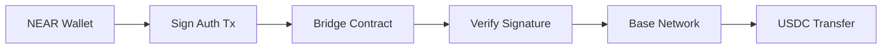

# Omni Transaction - Cross-Chain Demo Project

A complete demonstration of cross-chain USDC settlement using NEAR signatures, featuring both a Rust library and a modern web frontend.

## 🎯 Project Goals

- **Prove Cross-Chain Functionality**: Demonstrate USDC settlement on Base using NEAR signatures
- **Modular Architecture**: Clean, DRY code organization for easy maintenance and extension
- **Real-World Demo**: Working frontend that showcases the technology in action

## 🏗️ Architecture Overview

```
omni-transaction-rs/
├── src/                    # Rust library for cross-chain transactions
│   ├── near/              # NEAR protocol integration
│   ├── evm/               # EVM chains (Ethereum, Base, etc.)
│   └── bitcoin/           # Bitcoin integration
├── frontend/              # Modern web demo interface
│   ├── src/modules/       # Modular JavaScript architecture
│   ├��─ src/config/        # Configuration and constants
│   └── src/styles/        # Responsive CSS
├── examples/              # Rust usage examples
└── docs/                  # Documentation
```

## 🚀 Quick Start

### 1. Run the Rust Library Tests
```bash
# Build and test the core library
cargo build
cargo test --lib

# Try the examples
cargo run --example cross_chain_example
```

### 2. Launch the Frontend Demo
```bash
# Simple one-command startup
./run-demo.sh
```

The demo will be available at:
- **Vite dev server**: http://localhost:3000 (recommended)
- **HTTP server**: http://localhost:8080 (fallback)

## 🌟 Key Features

### Rust Library (`src/`)
- ✅ **Multi-Chain Support**: NEAR, Ethereum, Bitcoin, Base, Avalanche
- ✅ **Type-Safe Transactions**: Rust's type system ensures correctness
- ✅ **NEAR Signature Integration**: Use NEAR keys for cross-chain authorization
- ✅ **Comprehensive Testing**: 123+ unit tests covering all functionality

### Frontend Demo (`frontend/`)
- ✅ **Modern UI**: Clean, responsive interface with real-time updates
- ✅ **Wallet Integration**: NEAR wallet + MetaMask support
- ✅ **Cross-Chain Flow**: Complete USDC settlement demonstration
- ✅ **Modular Architecture**: DRY, maintainable JavaScript modules

## 🔄 Cross-Chain Flow



### Step-by-Step Process

1. **User Authorization**: Sign a transaction on NEAR to authorize the transfer
2. **Bridge Processing**: Bridge contract verifies the NEAR signature
3. **Signature Derivation**: Derive Base-compatible signature from NEAR signature
4. **Settlement**: Execute USDC transfer on Base network

## 🛠️ Technology Stack

### Backend (Rust)
- **Core**: Rust with Cargo for dependency management
- **Serialization**: Borsh for NEAR, RLP for Ethereum
- **Cryptography**: Ed25519 for NEAR, ECDSA for EVM chains
- **Testing**: Comprehensive unit and integration tests

### Frontend (JavaScript)
- **Build Tool**: Vite for fast development and building
- **Architecture**: Modular ES6 with event-driven communication
- **Styling**: Modern CSS with responsive design
- **Wallets**: NEAR Wallet Selector + MetaMask integration

## 📁 Project Structure

### Rust Library Organization
```
src/
├── lib.rs                 # Main library exports
├── near/                  # NEAR protocol implementation
│   ├── types/            # NEAR-specific types
│   ├── utils/            # Helper functions
│   └── near_transaction.rs
├── evm/                   # EVM chains implementation
│   ├── types.rs          # EVM transaction types
│   └── evm_transaction.rs
└── bitcoin/               # Bitcoin implementation
    ├── types/            # Bitcoin-specific types
    └── bitcoin_transaction.rs
```

### Frontend Organization
```
frontend/src/
├── main.js               # Application entry point
├── config/
│   └── constants.js      # Network configs, ABIs, etc.
├── modules/
│   ├── walletManager.js  # Wallet connections
│   ├── transactionManager.js # Cross-chain logic
│   ├── uiManager.js      # UI state management
│   ├── logger.js         # Centralized logging
│   └── eventEmitter.js   # Inter-module communication
└── styles/
    └── main.css          # Responsive styling
```

## 🔧 Development Workflow

### Adding New Chains

1. **Rust Library**:
   ```rust
   // Add to src/new_chain/
   pub mod new_chain_transaction;
   pub mod types;
   ```

2. **Frontend**:
   ```javascript
   // Update CONFIG.NETWORKS in constants.js
   // Add wallet logic in walletManager.js
   // Implement transaction building in transactionManager.js
   ```

### Testing Strategy

- **Unit Tests**: Test individual components in isolation
- **Integration Tests**: Test cross-chain workflows end-to-end
- **Frontend Testing**: Manual testing with wallet connections
- **Demo Scenarios**: Predefined test cases for demonstrations

## 🌐 Network Support

### Currently Supported
- **NEAR Protocol**: Testnet ready
- **Base Network**: Sepolia testnet
- **Ethereum**: Mainnet and testnets
- **Bitcoin**: Mainnet and testnet

### Easily Extensible To
- **Avalanche**: C-Chain support
- **Polygon**: EVM compatibility
- **Arbitrum**: L2 scaling
- **Any EVM Chain**: Minimal configuration needed

## 🔐 Security Considerations

- **Private Key Safety**: Never expose private keys in frontend
- **Signature Verification**: Proper cryptographic verification
- **Input Validation**: Comprehensive validation on all inputs
- **Network Security**: Use secure RPC endpoints
- **Error Handling**: Graceful failure modes

## 📊 Demo Scenarios

### Scenario 1: USDC Settlement
- **Source**: NEAR Protocol
- **Destination**: Base Network
- **Asset**: USDC (6 decimals)
- **Flow**: NEAR signature → Bridge → Base transfer

### Scenario 2: Multi-Chain Support
- **Chains**: NEAR → Ethereum, NEAR → Avalanche
- **Flexibility**: Same signature, multiple destinations
- **Efficiency**: Single authorization, multiple settlements

## 🚀 Deployment

### Development
```bash
# Rust library
cargo build
cargo test

# Frontend
cd frontend
npm install
npm run dev
```

### Production
```bash
# Build optimized Rust library
cargo build --release

# Build frontend for production
cd frontend
npm run build
# Deploy dist/ folder to web server
```

## 📈 Future Enhancements

### Short Term
- [ ] Real WASM integration with Rust library
- [ ] Actual bridge contract deployment
- [ ] Enhanced error handling and recovery
- [ ] Mobile-responsive improvements

### Long Term
- [ ] Additional chain integrations
- [ ] Advanced transaction batching
- [ ] Governance token integration
- [ ] Cross-chain DEX functionality

## 🤝 Contributing

1. **Follow the Architecture**: Maintain modular, DRY principles
2. **Add Tests**: Include tests for new functionality
3. **Document Changes**: Update relevant documentation
4. **Code Quality**: Use proper error handling and logging

## 📞 Support

- **Documentation**: Check the `docs/` directory
- **Examples**: See `examples/` for usage patterns
- **Issues**: Report bugs and feature requests
- **Community**: Join the [Chain Abstraction Telegram](https://t.me/chain_abstraction)

---

**Ready to explore cross-chain transactions?** Run `./run-demo.sh` and start the demo! 🚀